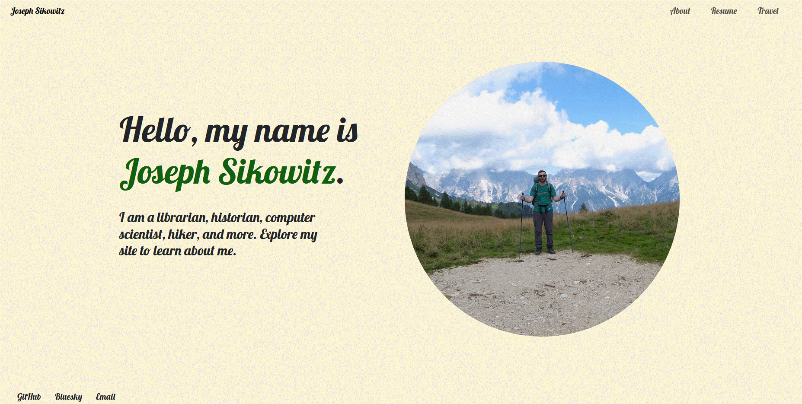

# Joseph Sikowitz's Homepage

## Project Objective

A personal homepage to share my professional background and personal interests. The site includes an introduction, an about page, a resume, and travel photos and information.

## Screenshot



## Technologies and Requirements

- HTML5
- CSS3
- Vanilla JavaScript (ES modules)
- Bootstrap 5.3.8, loaded from jsDelivr
- Google Fonts (Lobster)
- A modern web browser
- An internet connection to load Bootstrap and Google Fonts from their CDNs
- A local static HTTP server to serve the site from the project root

No package installation or build step is required to run the website.

## Install and Use

1. Clone this repository and open a terminal in the project directory.
2. Start a static web server from the project root. For example, with Python:

   ```bash
   python -m http.server 8000
   ```

3. Open [http://localhost:8000](http://localhost:8000) in your browser.
4. Use the navigation bar to visit the About, Resume, and Travel pages. On the Travel page, open the trip dropdown and select a destination to start its countdown clock.
5. Stop the server with `Ctrl+C` when you are finished.

## Author

Joseph Sikowitz — [Homepage](#)

<!-- Replace the placeholder link with the public homepage URL when available. -->

## Course

[Web Development (Online), Fall 2026](https://johnguerra.co/classes/webDevelopment_online_fall_2026/)

## Video Demo

[Video demo coming soon](#)

<!-- Replace the placeholder link with the video demo URL when available. -->

## Creative Addition

The Travel page includes a trip countdown clock built with JavaScript. Selecting a destination starts a live countdown showing the time remaining until departure.
