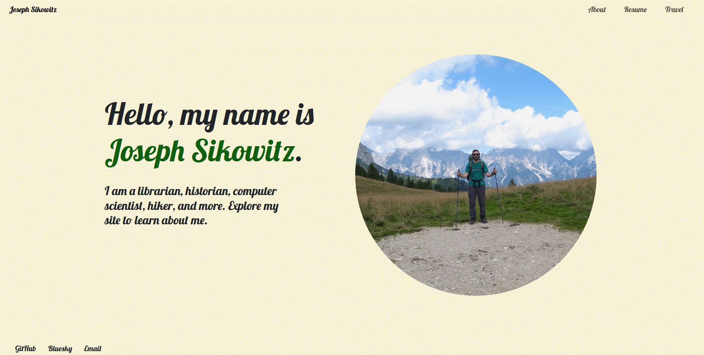

# Joseph Sikowitz's Personal Homepage

## Project Objective

The objective of this project was to design and implement a personal homepage using vanilla HTML5, CSS3, and ES6. In addition to these components, we were able to use Bootstrap 5. For the site, we were required to have at least two pages that were created without the assistance of AI and one that we used AI to produce. Additionally, we needed to add a creative addition that differentiated it from others.

My personal homepage serves as a personal and professional introduction to me. The personal side is covered in the about and travel sections while my professional experience is displayed by my resume. It also contains links to my GitHub, Bluesky, and email address so that people interested in my experience can delve deeper. All pages were handmade by the author except for the resume page which was made with GitHub Copilot and then edited (see [Generative AI Usage](#generative-ai-usage) section for details).

## Creative Additions

**Primary:** The Travel page includes a trip countdown clock built with JavaScript. Selecting a destination starts a live countdown showing the time remaining until departure.

**Additional:** Other creative elements in this project include the image hover text that shows my personal story and the Bootstrap carousel on the Travel page that shows my recent trips.

## Deployment URL

https://joseph-sikowitz.github.io/homepage/

## Screenshot



## Technologies and Requirements

- HTML5
- CSS3
- Vanilla JavaScript (ES modules)
- Bootstrap 5.3.8
- Google Fonts (Lobster)
- A modern web browser
- An internet connection to load Bootstrap and Google Fonts from their CDNs
- A local static HTTP server to serve the site from the project root
- node.js

No package installation or build step is required to run the website.

## File Structure

```text
homepage/
├── css/
│   └── main.css
├── docs/
│   ├── RESUME-PLAN.md
│   └── design-document.pdf
├── img/
│   ├── block-island.jpg
│   ├── boston-skyline.jpeg
│   ├── corsica-1.jpg
│   ├── corsica-2.JPG
│   ├── corsica-3.jpg
│   ├── corsica-4.jpg
│   ├── corsica-5.jpg
│   ├── dolomites-1.jpeg
│   ├── dolomites-2.jpg
│   ├── dolomites-3.JPG
│   ├── dolomites-4.JPG
│   ├── dolomites-5.JPG
│   ├── favicon.ico
│   ├── homepage-screenshot.gif
│   ├── homepage-thumbnail.jpg
│   ├── mardi-gras.jpg
│   ├── pr-1.jpeg
│   ├── pr-2.jpeg
│   ├── pr-3.jpeg
│   ├── pr-4.jpeg
│   ├── vermont-winter.jpg
│   ├── washington-capitol.jpg
│   └── washington-hall.jpg
├── js/
│   └── main.js
├── pages/
│   ├── about.html
│   ├── resume.html
│   └── travel.html
├── .gitignore
├── eslint.config.js
├── index.html
├── LICENSE
├── package.json
├── README.md
└── package-lock.json
```

## Install and Use

1. Clone this repository and open a terminal in the project directory.
2. Install the needed development tools:

   ```bash
   npm install
   ```

3. Start a static web server from the project root. For example, with node:

   ```bash
   npx http-server
   ```

4. Open [http://localhost:8080](http://localhost:8080) in your browser. Port 8080 may not
   be the default in your setup but use the port that is indicated.
5. Use the navigation bar to visit the About, Resume, and Travel pages. On the Travel page, open the trip dropdown and select a destination to start its countdown clock.
6. Stop the server with `Ctrl+C` when you are finished.

## Author

Joseph Sikowitz — [Homepage](https://joseph-sikowitz.github.io/homepage/)

## Course

Northeastern University, [Web Development (Online), Fall 2026](https://johnguerra.co/classes/webDevelopment_online_fall_2026/).

Instructor: [John Alexis Guerra Gómez](https://johnguerra.co/).

## Generative AI Usage

1. **Creation of the resume.html page.** I used **GitHub Copilot SDK** to create one page entirely as required by the project specifications. I asked it to create a plan (see [resume plan](/docs/RESUME-PLAN.md) before creating the page, but then had to have it iterate the plan as well as the page once it was created. After that point I made small edits to further fix issues. The prompts I used to create the plan and iterate through the issues it created are as follows.

"I want you to think about what I'm asking as if you're a full stack web developer with 20 years of experience. Please only provide a plan-don't edit any files. I want you to come up with a plan for using hte data in the resume I have uploaded to make a resume page that integrates with the website that I have created in this project. It will be used in the /pages/resume.html page. It should match the aesthetics of the current site very closely and provide a clear way to read my resume. Again, don't implement anything until I agree that your plan works for me."

"I've added my resume to this folder. Please proceed, but again, only in plan mode so you don't change anything."

"Can you output this plan to a markdown file?"

"Still stay in plan mode. Can you make it so that each section is clearly deliniated with Bootstrap 5 tools?"

"Still stay in plan mode. Do not remove the footer email link. Append this to the plan."

"Still stay in plan mode. Do not add CSS directly to resume.html. Can you add it to css/main.css? Do not remove any of the existing CSS in main.css but add your CSS to it and set up the appropriate linking. Once you've done this, append a note about this change to the resume-plan."

"Still stay in plan mode. Can you add a green Bootstrap alert at the top of the page that indicates that the page was generated with AI? Make the text of the alert, "This page created with generative AI."

"Still stay in plan mode. Can you add a green Bootstrap alert at the top of the page that indicates that the page was generated with AI? Make the text of the alert, "This page created with generative AI.""

"Can you rewrite the /pages/resume.html page following this plan exactly? Do not write to any other files in the project!"

2. **Troubleshooting GitHub Pages Deployment** I used **GitHub Copilot SDK** to figure out why images from my site were not displaying after initially deploying the page. There were two issues. One was that while the paths worked on my local machine, they were not formatted the way that GitHub Pages' environment would be able to find them. The second was that some of the file extensions were capitalized and not properly referenced in the HTML. I used the following prompt.

"Three pictures from the Dolomites section of travel.html are not displaying in GitHub Pages. Can you tell me why? Do not make any changes!"

3. **Starting a Project README.md** I used **GitHub Copilot SDK** to get this README started. I did a lot of editing afterward though to get it to have the correct content. The prompt I used is as follows.

"I want you to help me get started with the README for this project. Only modify the README.md file and nothing else. The README should have the following elements: project name, project objective, screenshot (in img folder currently), tech requirements, how to install/use, author with a link to the homepage (not public yet so I will add the link later), a reference to the class with a link (https://johnguerra.co/classes/webDevelopment_online_fall_2026/), a link to the video demo (not created yet so just have a placeholder), and what the creative addition to the project was (the trip countdown clock that I created from Javascript). Do all of this in correct GitHub Markdown."

4. **Troubleshooting div Expansion with Javascript** I asked **Claude Sonnet 5** to help me troubleshoot a style issue. When my countdown clock appeared after selecting from the menu, it would push the surrounding div's spacing down. I wanted to figure out how to correct that. I used the following prompt.

"How can I make it so when the text from the dropdown appears via Javascript, the rest of the box doesn't shift? I'm fine with having blank space to start. Tell me how to do it. Do not write a solution. I want to learn how to do it myself."

## Documentation and Demos

- [Design Document](/docs/design-document.pdf)
- [Google Slides](https://docs.google.com/presentation/d/159G4EYVJF27qTT-3annWVBwfdkwnY4LgsU-sRJ8zeAM/edit?usp=sharing)
- Add slide presentation video here
- Add page video demo here
